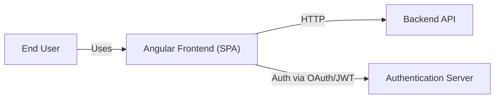
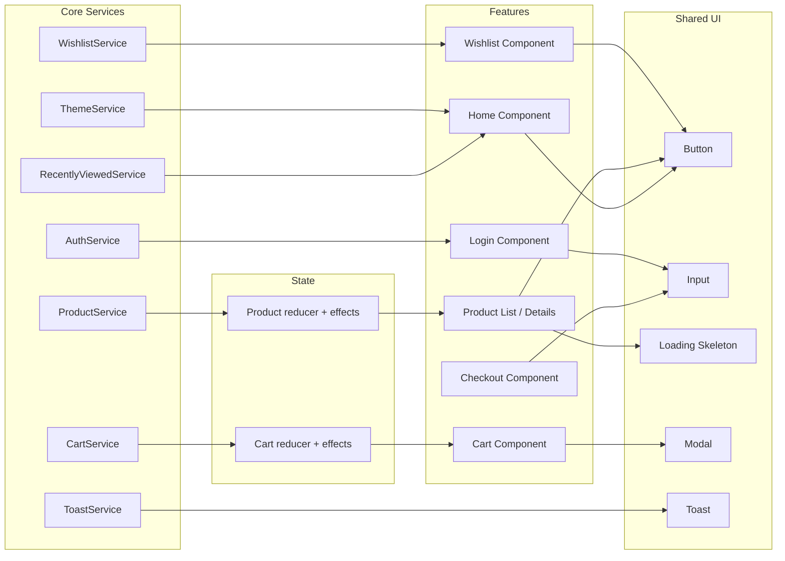

# Architecture Overview

This document provides a high-level architecture diagram of the Angular e-commerce application using Mermaid diagrams.

## Context Diagram



## Container Diagram

```mermaid
graph TD
    subgraph Angular Frontend
        bootstrap[bootstrapApplication + app.config.ts]
        appComponent[AppComponent (standalone)]
        layout[LayoutComponent]
        routes[Lazy Routes (home, products, cart, checkout, wishlist, auth)]
        store[NgRx Store (cart, products)]
        interceptors[HTTP interceptors]
    end

    bootstrap --> appComponent --> layout --> routes
    bootstrap --> store
    bootstrap --> interceptors
    store --> routes
    interceptors --> api["Backend API"]
```

## Feature Relationships



> 🔧 You can preview these diagrams with the Mermaid previewer in VS Code or online tools. Adjust as needed to capture additional details.
