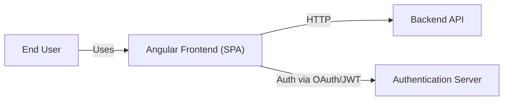
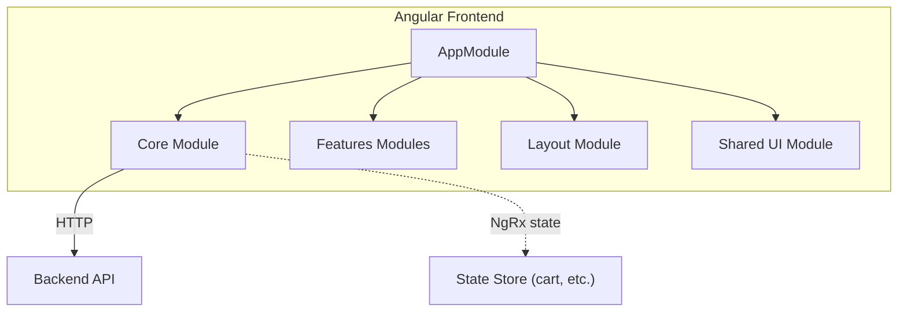
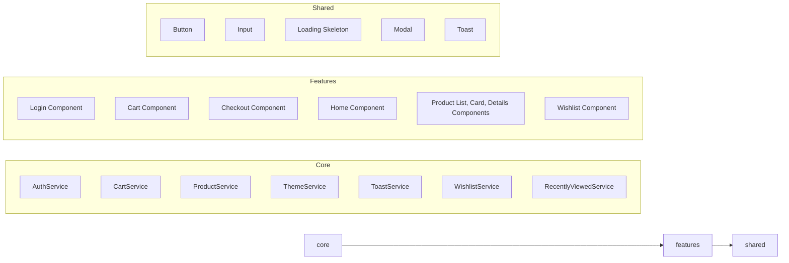

# Architecture Overview

This document provides a high-level architecture diagram of the Angular e-commerce application using Mermaid diagrams.

## Context Diagram

## Container Diagram

## Module Relationships

> 🔧 You can preview these diagrams with the Mermaid previewer in VS Code or online tools. Adjust as needed to capture additional details.